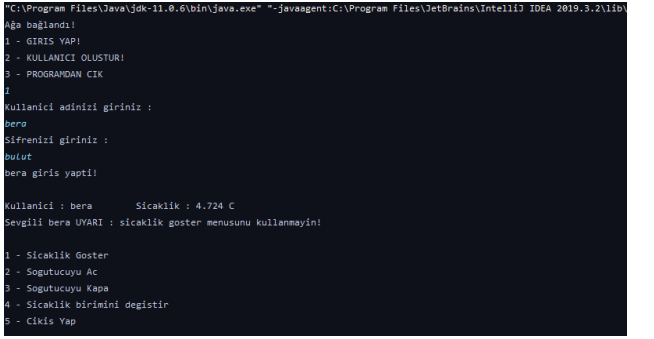

<h3>My project for Object Oriented Analysis and Design class.</h3> 

It's a basic console application. You can create new users and login to their accounts. It has a **database authorization**. 
  

In the user account you are able to create a random temperature. You can convert temperatures Celcius to Fahrenheit and vice versa. Also program remembers which unit you prefer after you log out.

Used **Open/Closed** principal from SOLID and used **Singleton** and **Observer** design patterns.

</img> 
